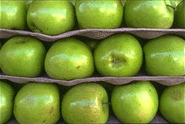
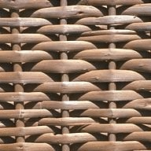

<!-- PROJECT LOGO -->
<div align="center">
  <a href="https://github.com/andreihar/quilt-tex">
    
  </a>
  
# QuiltTex


<!-- PROJECT SHIELDS -->
[![Contributors][contributors-badge]][contributors]
[![Licence][licence-badge]][licence]
[![LinkedIn][linkedin-badge]][linkedin]

**Texture Synthesis and Transfer**

Algorithms for generating seamless textures and applying them onto another image’s structure, using patch-based methods for natural results.


</div>


---


<!-- TABLE OF CONTENTS -->
<details open>
  <summary>Table of Contents</summary>
  <ol>
    <li>
      <a href="#about-the-project">About The Project</a>
      <ul>
        <li><a href="#built-with">Built With</a></li>
      </ul>
    </li>
    <li><a href="#run">Run</a></li>
    <li>
      <a href="#functional-areas">Functional Areas</a>
      <ul>
        <li>
          <a href="#texture-synthesis">Texture Synthesis</a>
          <ul>
            <li><a href="#random-patch-selection">Random Patch Selection</a></li>
            <li><a href="#overlap-constrained-patch-selection">Overlap-Constrained Patch Selection</a></li>
            <li><a href="#minimum-error-boundary-cut">Minimum Error Boundary Cut</a></li>
          </ul>
        </li>
        <li><a href="#texture-transfer">Texture Transfer</a></li>
        <li><a href="#tkinter-app">Tkinter App</a></li>
      </ul>
    </li>
    <li><a href="#contributors">Contributors</a></li>
    <li><a href="#licence">Licence</a></li>
  </ol>
</details>


<!-- ABOUT THE PROJECT -->
## About The Project

QuiltTex is a project developed for the course in Computational Photography and Image Manipulation in the Spring semester of 2024. The project explores advanced techniques in texture synthesis and texture transfer, drawing inspiration from the [pioneering work by Efros and Freeman][efros]. The primary focus of QuiltTex is to create seamless, visually coherent textures from small samples and to apply these textures to reimagine the appearance of other images.

The objective of this project was to implement and compare various methods of texture synthesis, including Random Patch Selection, Overlap-Constrained Patch Selection, and Minimum Error Boundary Cut, to understand their effectiveness in producing natural and continuous textures. Additionally, the project delves into texture transfer, where the goal was to apply the texture of one image onto the structural features of another, blending the content and texture to create visually striking effects.

QuiltTex demonstrates the practical application of these advanced techniques in texture manipulation, providing insights into the strengths and trade-offs of different methods. The project highlights the potential for creative image processing, offering tools that can be adapted for various artistic and practical applications in computational photography.

### Built With

* [![NumPy][numpy-badge]][numpy]
* [![CustomTkinter][ctk-badge]][ctk]


<!-- RUN -->
## Run

Open the notebook using your choice software in a terminal or command window by navigating to the top-level project directory, `quilt-tex`. For example, if the software is Jupyter Notebook:

```bash
jupyter notebook code.ipynb
```

To run the tkinter app:

```bash
cd app
pip install -r requirements.txt
python main.py
```


<!-- FUNCTIONAL AREAS -->
## Functional Areas

### Texture Synthesis

The texture synthesis process is based on the work by Efros and Freeman titled ["Image Quilting for Texture Synthesis and Transfer."][efros] The goal of texture synthesis is to generate a larger texture image from a small sample of an existing texture, ensuring that the synthesised texture looks natural and continuous without obvious seams or repetitions.

These texture synthesis approaches can be applied to various types of textures, whether structured (like bricks or tiles) or stochastic (like grass or sand). The choice of method and parameters, such as patch size and overlap width, depends on the specific characteristics of the input texture. For instance, highly structured textures may benefit more from Method 3 due to its ability to handle complex patterns with minimal visible seams.

Base textures chosen for comparison:

<p align="center">


</p>

#### Random Patch Selection

This is the simplest approach, where patches are randomly selected from the input texture and placed into the new image. Because the patches are chosen randomly without considering the overlap with adjacent patches, noticeable edges or seams are likely to appear in the synthesised texture. This can make the final image look disjointed or artificial.

<p align="center">


</p>

#### Overlap-Constrained Patch Selection

In this method, the algorithm selects patches that best match the existing content in the overlapping region, based on a similarity measure Sum of Squared Differences. Instead of just picking the patch with the absolute lowest error, the algorithm introduces some randomness by selecting from among the patches that have errors within a certain tolerance of the minimum error.

This method reduces the likelihood of visible seams by ensuring that the overlapping regions of adjacent patches are more closely matched. The slight randomness helps avoid the problem of repetitive patterns, creating a more natural texture.

<p align="center">


</p>

#### Minimum Error Boundary Cut

This method refines the overlap between patches even further by calculating the optimal boundary within the overlapping region. The algorithm computes an "energy matrix" representing the difference between overlapping patches and then finds a path through this matrix that minimises the error. This path becomes the boundary where the new patch is blended into the existing texture.

By allowing the patches to have irregular, "ragged" edges, this method effectively minimises visible seams, even for highly structured textures. The dynamic programming approach used to find the minimum error cut ensures that the transition between patches is as seamless as possible.

<p align="center">


</p>

### Texture Transfer

Texture transfer is a technique that re-renders an image by applying the texture of one image onto the structure of another. This process blends the patterns of the source texture with the underlying structure of the target image, creating a unique visual effect where the content of the target image appears to be made up of the source texture.

The process works by balancing two main constraints:

* **Texture Consistency**: Ensuring that each patch from the source texture fits seamlessly with the previously synthesised parts of the new image. This ensures that the overall texture looks natural and continuous.
* **Structural Correspondence**: Each texture patch must also align with the features of the target image. This is achieved by matching the source texture to a map of the target image's grayscale intensity. The resulting image retains the visual structure of the target while taking on the texture of the source.

To balance these constraints, an error metric combines texture matching with structural alignment, controlled by a parameter `alpha` that dictates the trade-off between texture fidelity and adherence to the target image's features. The image is processed in a single pass, with patches selected to simultaneously match the texture and align with the target image's structure.

This technique enables the creation of striking visual effects, like rendering a photograph with a different material's texture, producing an image that is both visually rich and true to the original structure.

<p align="center">


</p>

### Tkinter App

The QuiltTex project includes a CustomTkinter-based application that allows users to apply and experiment with the implemented texture synthesis and transfer methods. The app provides an intuitive interface for loading texture samples and target images, adjusting parameters, and viewing results in real-time. Users can also save the generated images directly through the app, making it a practical tool for texture manipulation and experimentation.

<p align="center">

</p>


<!-- CONTRIBUTION -->
## Contributors

- Andrei Harbachov ([Github][andrei-github] · [LinkedIn][andrei-linkedin])


<!-- LICENCE -->
## Licence

Because QuiltTex is MIT-licensed, any developer can essentially do whatever they want with it as long as they include the original copyright and licence notice in any copies of the source code.


<!-- MARKDOWN LINKS -->
<!-- Badges and their links -->
[contributors-badge]: https://img.shields.io/badge/Contributors-1-44cc11?style=for-the-badge
[contributors]: #contributors
[licence-badge]: https://img.shields.io/github/license/andreihar/quilt-tex.svg?color=000000&style=for-the-badge
[licence]: LICENSE
[linkedin-badge]: https://img.shields.io/badge/LinkedIn-0077B5?style=for-the-badge&logo=linkedin&logoColor=white
[linkedin]: https://www.linkedin.com/in/andreihar/
[numpy-badge]: https://img.shields.io/badge/numpy-013243?style=for-the-badge&logo=numpy&logoColor=ffffff
[numpy]: https://numpy.org/
[ctk-badge]: https://img.shields.io/badge/CustomTkinter-0087F2?style=for-the-badge&logo=square&logoColor=ffffff
[ctk]: https://customtkinter.tomschimansky.com/

<!-- Technical links -->
[efros]: http://graphics.cs.cmu.edu/people/efros/research/quilting/quilting.pdf

<!-- Socials -->
[andrei-linkedin]: https://www.linkedin.com/in/andreihar/
[andrei-github]: https://github.com/andreihar